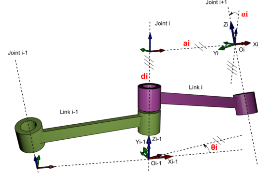

# ROBOT ARM

## Requirements:
- Raspberry Pi 3 Model B+
- Adafruit 16 Channel Servo Driver PWM PCA9685
- Servos MG996R
- Python 3
- Camera 

## Table of Contents

* [1. System Overview](#1.-system-overview)
* [2. Connect Raspberry Pi with PCA9685](#2.-connect-raspberry-pi-with-pca9685)
* [3. Servos Configuration](#servos-configuration)
* [4. Setup the Slask Server and Web UI for Controlling Servos](#setup-the-slask-server-and-web-ui-for-controlling-servos)
* [5. Pickup an object](#pickup-an-object)
    * [5.1 Setup a depth camera to get the object coordinate(x,y)]()  
    * [5.2 Convert (x,y) coordinate to Cartesian coordinate](#make-the-arm-work-in-cartesian-coordinate)
        * [5.2.1 Robot Kinematics](#)
        * [5.2.2 Forward Kinematics](#)
             * [5.2.2.1 Calculating Homodeneous Transformation Matrix](#)
        * [5.2.3 Invert Kinematics](#)
* [6. ROS](#ros)

## 1. System Overview

## 2. Connect Raspberry Pi with PCA9685

## 3. Servos Configuration

    # Set frequency to 60Hz, good for l298n h-bridge.
    PCA9685_pwm.set_pwm_freq(60)
    
    # Configure min and max servo pulse lengths
    servo_min = 150  # Min pulse length out of 4096
    servo_max = 600  # Max pulse length out of 4096
    
## 4. Setup the Slask Server and Web UI for controlling servos
## 5. Pickup an object
### 5.1 Setup a depth camera to get the object coordinate(x,y)
(researching...)
### 5.2 Convert (x,y) coordinate to Cartesian coordinate
#### 5.2.1 Robot Kinematics
Robot kinematics applies geometry to the study of the movement of multi-degree of freedom kinematic
chains that form the structure of robotic systems. A fundamental tool in robot kinematics
is the kinematics equations of the kinematic chains that form the robot. These non-linear
equations are used to map the joint parameters to the configuration of the robot system.

"Robot Arm" = Joints + Links. Speciffically, Joints are parts that allow motion (in our case, Joints are 6 servos) and Links are parts that connect Joints together.

a. Kinematic Diagram
Diagram that shows how the links and joints are connected together, when all of the joints variables have a value of 0.
There are some crucial rules:
- Rule 1: The Z axis must be the axis of rotation for a revolute joint, ot the direction of motion for a prismatic joint. 
- Rule 2: The X axis must be perpendicular both to its own Z axis, and the Z axis of the frame before it.
- Rule 3: All frames must follow the right-hand rule.
- Rule 4: Each X axis must intersect the Z axis of the frame before it. 

* There are 6 DoFs but we only need 5 DoFs, follow 4 rules above we got the kinematic diagram:  

#### 5.2.2 Forward Kinematics
Forward kinematics specifies the joint parameters and computes the configuration of the chain, following these steps below:
##### 5.2.2.1 Calculating Homodeneous Transformation Matrix
In detail, there are 2 methods to compute the HTM:
###### Method 1 (Basic): 
First, finding the rotation matrix and the displacement vector for each pair of subsequent frames and then assembling
those two components together into the homogeneous transformation matrix. 

* Calculating Rotation Matrices

* Calculating Displacement Vectors

The displacement vetor only has one column and it has 3 rows. The first row tells us the x position of the n frame in the m frame. The 2nd row tells us the 
Y position and the 3rd row tells us the Z posiiton.

* Assembling Rotation matrices and Displacement Vectors into Homogeneous Transformation Matrix:

###### Method 2 (Denavit Hartenberg):

In mechanical engineering, the Denavit–Hartenberg parameters 
(also called DH parameters) are the four parameters associated with a particular
convention for attaching reference frames to the links of a spatial kinematic 
chain, or robot manipulator. It is a kind of industry standard that we'll frequently see
in robotics research papers and industry documentation.

This method is faster than the other way but it kind of obscures the meaning behind the rotation matrix
and the displacement vector. So it is important to fist do the basic method above and make sure we understand the meaning of each 
part of the homogeneous transformation before we srat taking the shorcut method to the end.

The following 4 transformation parameters are known as D–H parameters:

* d - the distance between the previous x-axis and the current x-axis, along the previous z-axis.
* θ - the angle around the z-axis between the previous x-axis and current x-axis.
* a (or r) - the length of the common normal, which is the distance between the previous z-axis and the current z-axis.
* α - the angle around the common normal to between the previous z-axis and current z-axis.
 
- Step 1: Assign frames according to the 4 Denavit-Hartenberg rules.
- Step 2: Fill out the Denavit-Hartenberg parameter table. 
- Step 3: Get the Homogeneous transformation matrix

#### 5.2.3 Invert Kinematics
Inverse kinematics specifies the end-effector location and computes the associated joint angles.
#### 5.2.4 Implementation 
https://colab.research.google.com/drive/16oZtyKOfklekXpCMOa6KYnGSpCuyhuNP

## ROS
1. Install ROS
- http://wiki.ros.org/kinetic/Installation/Ubuntu

## References
* https://en.wikipedia.org/wiki/Denavit%E2%80%93Hartenberg_parameters

