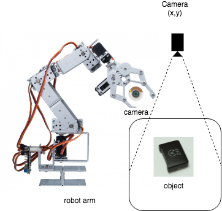

# ROBOT ARM

## Requirements:
- Raspberry Pi 3 Model B+
- Adafruit 16 Channel Servo Driver PWM PCA9685
- Servos MG996R

## System Overview

## Steps 

    1. Run Roscoe in pc
    2. Run Ros controller in Pi

        source ~/pca_ws/devel/setup.bash
        export ROS_MASTER_URI=“http://mypc:11311”
        rosrun ros_pca9685 controller_sub
    3. Run action_server
        source ~/ws_arm/devel/setup.bash
        python src/arm_controller/scripts/action_server.py
    4. Run i2c_joint
        source ~/ws_arm/devel/setup.bash
        python src/arm_controller/scripts/i2c_joint.py
    5. Run i2c_birdge 
       source ~/ws_arm/devel/setup.bash
       python src/arm_controller/scripts/i2c_bridge.py
    6. Run Moveit 
        cd ws_arm
source ~/ws_arm/devel/setup.bash
        roslaunch arm_moveit demo.launch
        roslaunch arm_moveit setup.assistant.launch
    7. Run rqt 
    8. Run camera in pi 
        source /opt/ros/kinetic/setup.bash
        export ROS_MASTER_URI=http://mypc:11311
        cd ~/ws_cam/src/raspicam_node
        roslaunch raspicam_node camera_module_v2_640x480_30fps.launch
        rosservice call /raspicam_node/start_capture
        rosrun rqt_image_view rqt_image_view
        to config camera:
        rosrun rqt_reconfigure rqt_reconfigure 
    9. Run pi camera server on pi
        python ws_cam/src/pi_camera_server/picamera_server.py
    10. Run motion_plaining
        source ~/ws_arm/devel/setup.bash
        python src/arm_controller/scripts/motion_plaining.py
    11. 

### Create a bash script to run may python files
    1. Create a demo.sh
    2. Pussh “#!bin/básh” at the first line
    3. Run chmod +x demo.sh
    4. ./demo.sh to run

## Ideas
    1. Pick&Place object by using camera (Object recognization)
    Within the context of this project, a single pick and place cycle can be divided into the following tasks:

        * Identify the target object on the board
        * Plan and perform a clean movement towards the object
        * Efficiently grasp/pick the target object without disturbing other objects
        * Plan and perform a clean movement towards the drop-off site
        * Efficiently stow/place the object at the drop-off site
        
    2. Apply Machine learning to classify objects 
    3. Connect the Arm to the conveyor 
## Improvements 
    1. Fix and update URDF of the robot arm.
    2. Visualize object in Rviz 
    3. Restruct the current system (PC + Rasp) -> Only using Rasp
## Write an article 

    Structure of the article:
    
    Title: Building a Robot Arm with ROS
    
    - Chapter 1: Robot Operate System
    - Chapter 2: Making a skeleton of the Robot Arm 
    - Chapter 3: Communication between of the Arm and ROS by using Raspberry Pi 
    - Chapter 4: Basic Kinematic movement and framework to optimize motion plaining.
    - Chapter 5: Implementation 
    

